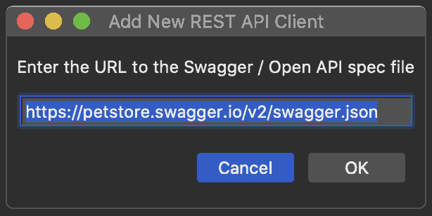
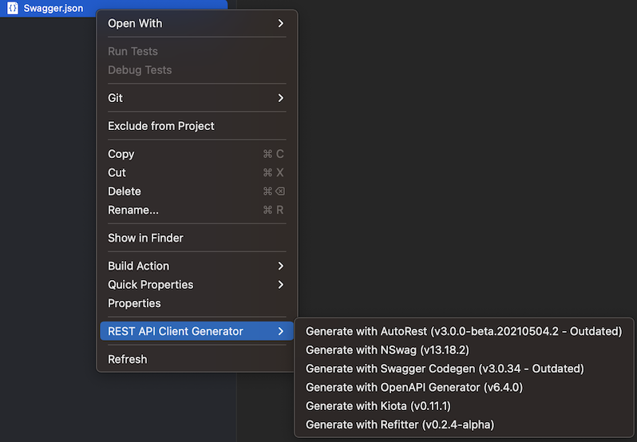
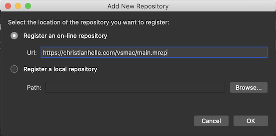
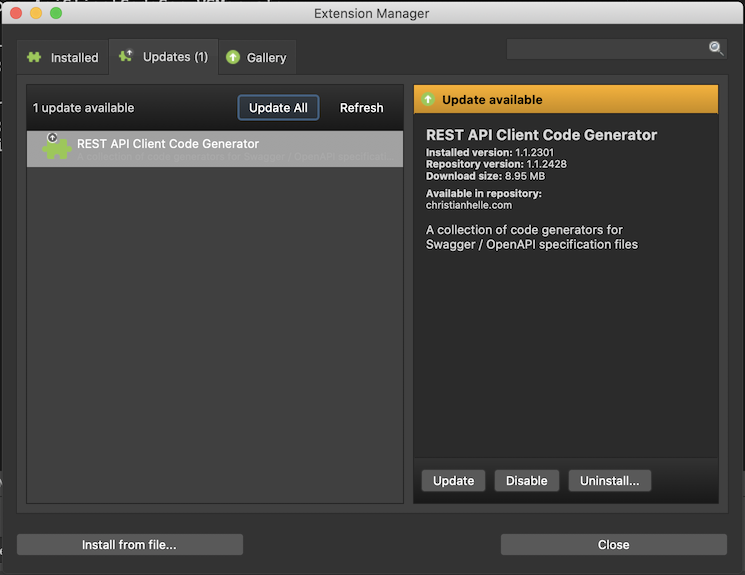
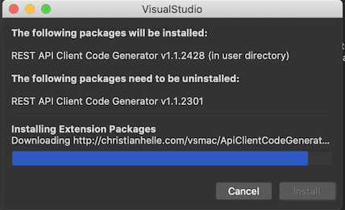

# REST API Client Code Generator
A collection of Visual Studio C# custom tool code generators for Swagger / OpenAPI specification files

## Features

- Supports Visual Studio for Mac
- Add New REST API Client to a project from an OpenAPI specification URL (e.g https://petstore.swagger.io/v2/swagger.json) using [NSwag](https://github.com/RicoSuter/NSwag), [OpenAPI Generator](https://github.com/OpenAPITools/openapi-generator), [Swagger Codegen](https://github.com/swagger-api/swagger-codegen), [Refitter](https://github.com/christianhelle/refitter), [Microsoft Kiota](https://github.com/microsoft/kiota), or  [AutoRest](https://github.com/Azure/autorest)
- Auto-updating of generated code file when changes are made to the OpenAPI specification JSON or YAML file
- Generate code using an [NSwagStudio](https://github.com/RicoSuter/NSwag/wiki/NSwagStudio) specification file by including it in the project and using the **Generate with NSwag** context menu

### Custom Tools

- ***NSwagCodeGenerator*** - Generates a single file C# REST API Client using the [NSwag.CodeGeneration.CSharp](https://github.com/RSuter/NSwag/wiki/CSharpClientGenerator) [nuget package](https://www.nuget.org/packages/NSwag.CodeGeneration.CSharp/) **v14.0.0**

- ***OpenApiCodeGenerator*** - Generates a single file C# REST API Client using **[OpenAPI Generator v7.2.0](https://github.com/OpenAPITools/openapi-generator/releases/tag/v7.2.0)**.
The output file is the result of merging all the files generated using the OpenAPI Generator tool with:
` generate -g csharp --input-spec [swagger file] --output [output file] -DapiTests=false -DmodelTests=false -DpackageName=[default namespace] --skip-overwrite`

- ***KiotaCodeGenerator*** - Generates a single file C# REST API Client using the Microsoft project **[Kiota v1.9.1](https://learn.microsoft.com/en-us/openapi/kiota/)** generator. 
The output file is the result of merging all the files generated using the Kiota dotnet tool with:
` generate -l CSharp -d [swagger file] -o [output file] -n [default namespace]`

- ***SwaggerCodeGenerator*** - Generates a single file C# REST API Client using **Swagger Codegen CLI v3.0.34**.
The output file is the result of merging all the files generated using the Swagger Codegen CLI tool with:
` generate -l csharp --input-spec [swagger file] --output [output file] -DapiTests=false -DmodelTests=false -DpackageName=[default namespace] --skip-overwrite`

- ***AutoRestCodeGenerator*** - Generates a single file C# REST API Client using **AutoRest v3.0.0-beta.20210504.2** for OpenAPI v3 and **AutoRest v2.0.4417** for OpenAPI v2. 
The resulting file is the equivalent of using the AutoRest CLI tool with:+
` --csharp --input-file=[swagger file] --output-file=[output file] --namespace=[default namespace] --add-credentials`

- ***RefitterCodeGenerator*** - Generates a single file C# REST API Client inteface for [Refit](https://github.com/reactiveui/refit) using [Refitter.Core](https://github.com/christianhelle/refitter) [nuget package](https://www.nuget.org/packages/Refitter.Core/) **v0.9.0**.
The output file contains a Refit interface generated by [Refitter](https://github.com/christianhelle/refitter) and contracts generated using [NSwag.CodeGeneration.CSharp](https://github.com/RSuter/NSwag/wiki/CSharpClientGenerator) [nuget package](https://www.nuget.org/packages/NSwag.CodeGeneration.CSharp/)

### Dependencies

The custom tool code generators piggy back on top of well known Open API client code generators like **AutoRest**, **NSwag**, **OpenAPI Generator**, **Microsoft Kiota**, **Refitter**, and **Swagger Codegen CLI**. These tools require [NPM](https://www.npmjs.com/get-npm) and the [Java Runtime Environment](https://java.com/en/download/manual.jsp) to be installed on the developers machine. Alternative Java SDK implementations such as the [OpenJDK](https://adoptopenjdk.net) works fine with this extension. By default, the path to **java.exe** is read from the **JAVA_HOME** environment variable, but is also configurable in the Settings screen

The **Swagger Codegen CLI** and **OpenAPI Generator** are distributed as JAR files and are downloaded on demand but requires the Java SDK to be installed on the machine. **AutoRest** is installed on-demand via [NPM](https://www.npmjs.com/get-npm) as a global tool and uses the latest available version. **Microsoft Kiota** is installed on-demand as a .NET Tool and requires .NET 7.0. This means that using these custom tools have an initial delay upon first time use. 

**NSwagStudio** is stand alone UI tool for editing a **.nswag** specification file for generating code. This tool is optional to install and official installation instructions are available on the [NSwag Wiki on Github](https://github.com/RicoSuter/NSwag/wiki/NSwagStudio). If **NSwagStudio** is not installed on the machine then the Visual Studio Extension will install the **NSwag CLI** via [NPM](https://www.npmjs.com/get-npm) as a global tool using the latest available version. 

The **NSwag** code generator produces code that depends on the [Newtonsoft.Json](https://www.nuget.org/packages/Newtonsoft.Json/13.0.3) NuGet package

The **Refitter** code generator produces code that depends on the [Refit](https://www.nuget.org/packages/Refit/7.0.0) NuGet package

The **OpenAPI Generator** code generator produces code that depends on the following NuGet packages:
- [RestSharp](https://www.nuget.org/packages/RestSharp/110.2.0)
- [JsonSubTypes](https://www.nuget.org/packages/JsonSubTypes/2.0.1)
- [Polly](https://www.nuget.org/packages/Polly/8.2.1)
- [Newtonsoft.Json](https://www.nuget.org/packages/Newtonsoft.Json/13.0.3)

The project **Kiota** code generator produces code that depends on the following NuGet packages
- [Microsoft.Kiota.Abstractions](https://www.nuget.org/packages/Microsoft.Kiota.Abstractions)
- [Microsoft.Kiota.Http.HttpClientLibrary](https://www.nuget.org/packages/Microsoft.Kiota.Http.HttpClientLibrary)
- [Microsoft.Kiota.Serialization.Form](https://www.nuget.org/packages/Microsoft.Kiota.Serialization.Form)
- [Microsoft.Kiota.Serialization.Text](https://www.nuget.org/packages/Microsoft.Kiota.Serialization.Text)
- [Microsoft.Kiota.Serialization.Json](https://www.nuget.org/packages/Microsoft.Kiota.Serialization.Json)
- [Microsoft.Kiota.Serialization.Multipart](https://www.nuget.org/packages/Microsoft.Kiota.Serialization.Multipart)
- [Microsoft.Kiota.Authentication.Azure](https://www.nuget.org/packages/Microsoft.Kiota.Authentication.Azure)
- [Azure.Identity](https://www.nuget.org/packages/Azure.Identity)

The **Swagger Codegen CLI** code generator produces code that depends on the [RestSharp](https://www.nuget.org/packages/RestSharp/105.1.0) and [JsonSubTypes](https://www.nuget.org/packages/JsonSubTypes/1.2.0) NuGet packages

The **AutoRest** code generator produces code that depends on the [Microsoft.Rest.ClientRuntime](https://www.nuget.org/packages/Microsoft.Rest.ClientRuntime/2.3.24) and [Newtonsoft.Json](https://www.nuget.org/packages/Newtonsoft.Json/13.0.3) NuGet packages

***NOTE: Visual Studio for Mac version currently installs missing NuGet packages via the dotnet CLI tool***

## Screenshots

## Installation

This installation process for **Visual Studio for Mac** is currently a bit troublesome as the MonoDevelop Addin Repository is currently not accepting new users so I can't really register and setup my extension.

There are 2 ways of installing my extension on Visual Studio for Mac: Adding a custom extension repository or Installing the **.mpack** file directly from the Extensions Manager

### Adding a new extension repository

Here's what you need to do:

- Open the Visual Studio for Mac **Extension Manager**
- You can do this from the menu **Visual Studio** -> **Extentions**

- Select the **Gallery** Tab
- Expand the Repository drop down box and select **Manage Repositories**

- Press on the **Add** button to add a new custom extension repository

- Register an online repository at **https://christianhelle.com/vsmac/main.mrep**
- Click **OK**

- Now my extension repository is added to the list
- Make sure that this is enabled (indicated by a check box)

- You should now be able to see my extensions from the **Gallery** tab

- By adding my extension repository you will be able to conveniently update my extension using the Visual Studio for Mac Extension Manager

### Installing the **.mpack** file directly

Here's what you need to do:
- Download the latest **.mpack file** from the [Latest Github Release](https://github.com/christianhelle/apiclientcodegen/releases/latest)
- Now from within Visual Studio for Mac you need to launch the **Extensions Dialog Box**. You can do this from the menu **Visual Studio** -> **Extentions**

- Click on the **Install from File** button

- Browse to the .mpack file and select it. You will be prompted with a confirmation dialog

- Click **Install** and restart Visual Studio for Mac
- To Verify that the Add-in was installed you can re-open the Extensions Dialog Box, select the **Installed** tab and expand the **IDE Extensions**. You should be able to see the **REST API Client Code Generator**.

- Uninstalling the Add-in is done in this same dialog box by clicking the **Uninstall** button

#
For tips and tricks on software development, check out [my blog](https://christianhelle.com)

If you find this useful and feel a bit generous then feel free to [buy me a coffee](https://www.buymeacoffee.com/christianhelle) :)

