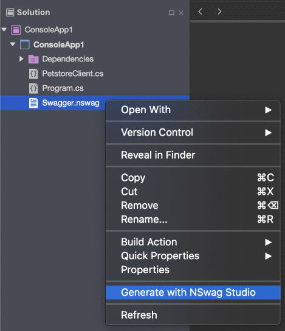
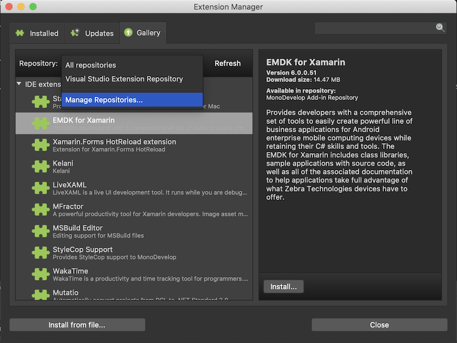
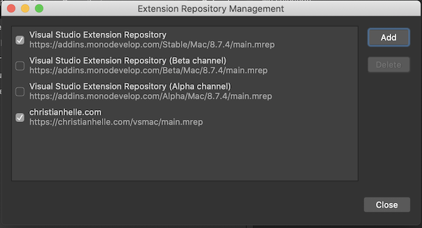
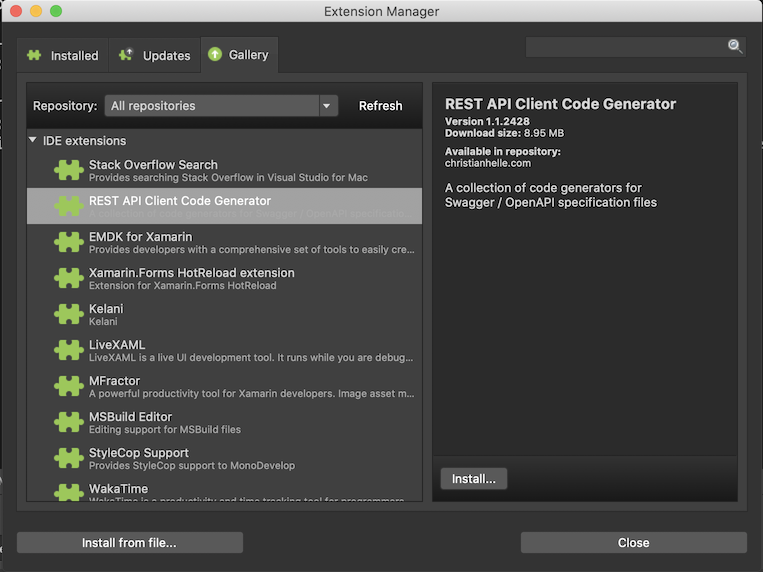
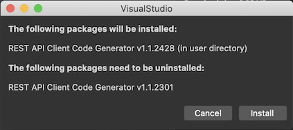
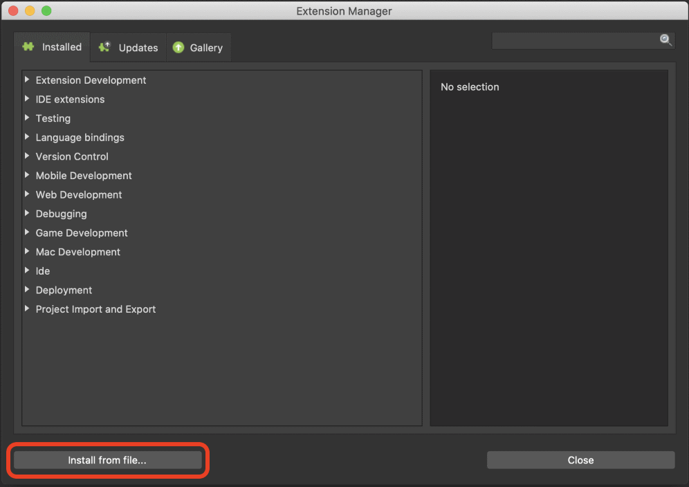
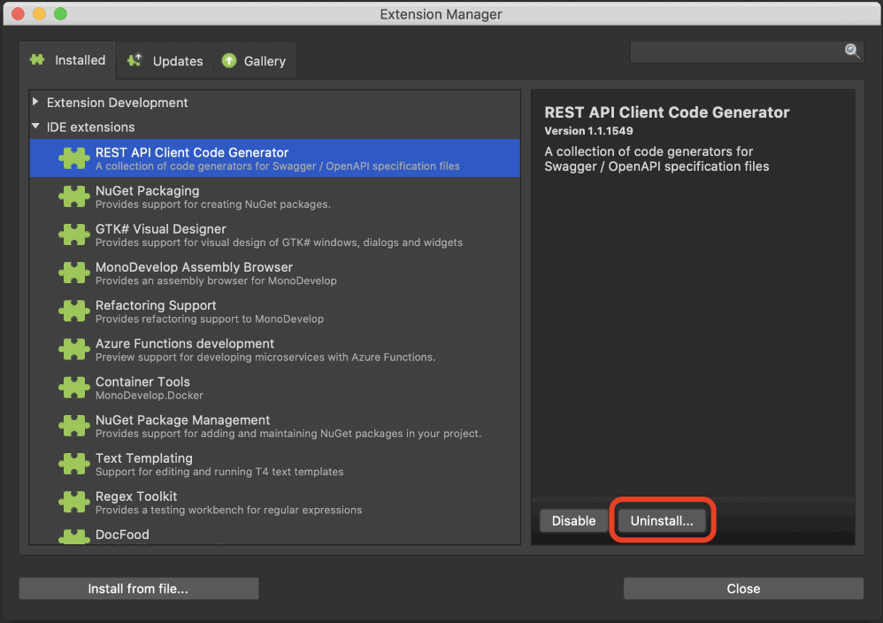

# REST API Client Code Generator
A collection of Visual Studio C# custom tool code generators for Swagger / OpenAPI specification files

## Features

- Supports Visual Studio for Mac
- Add New REST API Client to a project from an OpenAPI specification URL (e.g https://petstore.swagger.io/v2/swagger.json) using [AutoRest](https://github.com/Azure/autorest), [NSwag](https://github.com/RicoSuter/NSwag), [Swagger Codegen](https://github.com/swagger-api/swagger-codegen), or [OpenAPI Generator](https://github.com/OpenAPITools/openapi-generator)
- Define custom namespace for the generated file
- Auto-updating of generated code file when changes are made to the OpenAPI specification JSON or YAML file
- Generate code using an [NSwagStudio](https://github.com/RicoSuter/NSwag/wiki/NSwagStudio) specification file by including it in the project and using the **Generate with NSwag** context menu

### Custom Tools

- ***AutoRestCodeGenerator*** - Generates a single file C# REST API Client using **AutoRest**. 
The resulting file is the equivalent of using the AutoRest CLI tool with:
` --csharp --input-file=[swaggerFile] --output-file=[outputFile] --namespace=[namespace] --add-credentials`

- ***NSwagCodeGenerator*** - Generates a single file C# REST API Client using the [NSwag.CodeGeneration.CSharp](https://github.com/RSuter/NSwag/wiki/SwaggerToCSharpClientGenerator) [nuget package](https://www.nuget.org/packages/NSwag.CodeGeneration.CSharp/) **v13.17.0**

- ***SwaggerCodeGenerator*** - Generates a single file C# REST API Client using **Swagger Codegen CLI v3.0.34**.
The output file is the result of merging all the files generated using the Swagger Codegen CLI tool with:
` generate -l csharp --input-spec [swaggerFile] --output [output] -DapiTests=false -DmodelTests=false -DpackageName=[namespace] --skip-overwrite`

- ***OpenApiCodeGenerator*** - Generates a single file C# REST API Client using **OpenAPI Generator v6.2.0**.
The output file is the result of merging all the files generated using the OpenAPI Generator tool with:
` generate -g csharp --input-spec [swaggerFile] --output [output] -DapiTests=false -DmodelTests=false -DpackageName=[namespace] --skip-overwrite`

### Dependencies

The custom tool code generators piggy back on top of well known Open API client code generators like **AutoRest**, **NSwag**, **OpenAPI Generator**, and **Swagger Codegen CLI**. These tools require [NPM](https://www.npmjs.com/get-npm) and the [Java Runtime Environment](https://java.com/en/download/manual.jsp) to be installed on the developers machine. Alternative Java SDK implementations such as the [OpenJDK](https://adoptopenjdk.net) works fine with this extension. By default, the path to **java.exe** is read from the **JAVA_HOME** environment variable, but is also configurable in the Settings screen

The **Swagger Codegen CLI** and **OpenAPI Generator** are distributed as JAR files and are downloaded on demand but requires the Java SDK to be installed on the machine. **AutoRest** is installed on-demand via [NPM](https://www.npmjs.com/get-npm) as a global tool and uses the latest available version. This means that using these custom tools have an initial delay upon first time use. 

**NSwagStudio** is stand alone UI tool for editing a **.nswag** specification file for generating code. This tool is optional to install and official installation instructions are available on the [NSwag Wiki on Github](https://github.com/RicoSuter/NSwag/wiki/NSwagStudio). If **NSwagStudio** is not installed on the machine then the Visual Studio Extension will install the **NSwag CLI** via [NPM](https://www.npmjs.com/get-npm) as a global tool using the latest available version. 

The **OpenAPI Generator** code generator produces code that depends on the [RestSharp](https://www.nuget.org/packages/RestSharp/108.0.2) and [JsonSubTypes](https://www.nuget.org/packages/JsonSubTypes/1.2.0) NuGet packages 

The **NSwag** code generator produces code that depends on the [Newtonsoft.Json](https://www.nuget.org/packages/Newtonsoft.Json/13.0.1) NuGet package

The **Swagger Codegen CLI** code generator produces code that depends on the [RestSharp](https://www.nuget.org/packages/RestSharp/105.1.0) and [JsonSubTypes](https://www.nuget.org/packages/JsonSubTypes/1.2.0) NuGet packages

The **AutoRest** code generator produces code that depends on the [Microsoft.Rest.ClientRuntime](https://www.nuget.org/packages/Microsoft.Rest.ClientRuntime/2.3.21) and [Newtonsoft.Json](https://www.nuget.org/packages/Newtonsoft.Json/13.0.1) NuGet packages

***NOTE: The brand new Visual Studio for Mac version currently does not have support for automatically adding missing NuGet packages***

## Screenshots

## Installation

The Visual Studio extension can be installed directly from Visual Studio 2017 or 2019 via the **Extensions Dialog Box**. The process is best described in the official Microsoft documentation for [Managing extensions for Visual Studio](https://docs.microsoft.com/en-us/visualstudio/ide/finding-and-using-visual-studio-extensions?view=vs-2019&WT.mc_id=DT-MVP-5004822)

### Visual Studio for Mac

This installation process for **Visual Studio for Mac** is currently a bit troublesome as the MonoDevelop Addin Repository is currently not accepting new users so I can't really register and setup my extension.

There are 2 ways of installing my extension on Visual Studio for Mac: Adding a custom extension repository or Installing the **.mpack** file directly from the Extensions Manager

### Adding a new extension repository

Here's what you need to do:

- Open the Visual Studio for Mac **Extension Manager**
- You can do this from the menu **Visual Studio** -> **Extentions**

- Select the **Gallery** Tab
- Expand the Repository drop down box and select **Manage Repositories**

- Press on the **Add** button to add a new custom extension repository

- Register an online repository at **https://christianhelle.com/vsmac/main.mrep**
- Click **OK**

- Now my extension repository is added to the list
- Make sure that this is enabled (indicated by a check box)

- You should now be able to see my extensions from the **Gallery** tab

- By adding my extension repository you will be able to conveniently update my extension using the Visual Studio for Mac Extension Manager

### Installing the **.mpack** file directly

Here's what you need to do:
- Download the latest **.mpack file** from the [Latest Github Release](https://github.com/christianhelle/apiclientcodegen/releases/latest)
- Now from within Visual Studio for Mac you need to launch the **Extensions Dialog Box**. You can do this from the menu **Visual Studio** -> **Extentions**

- Click on the **Install from File** button

- Browse to the .mpack file and select it. You will be prompted with a confirmation dialog

- Click **Install** and restart Visual Studio for Mac
- To Verify that the Add-in was installed you can re-open the Extensions Dialog Box, select the **Installed** tab and expand the **IDE Extensions**. You should be able to see the **REST API Client Code Generator**.

- Uninstalling the Add-in is done in this same dialog box by clicking the **Uninstall** button

#
For tips and tricks on software development, check out [my blog](https://christianhelle.com)

If you find this useful and feel a bit generous then feel free to [buy me a coffee](https://www.buymeacoffee.com/christianhelle) :)

